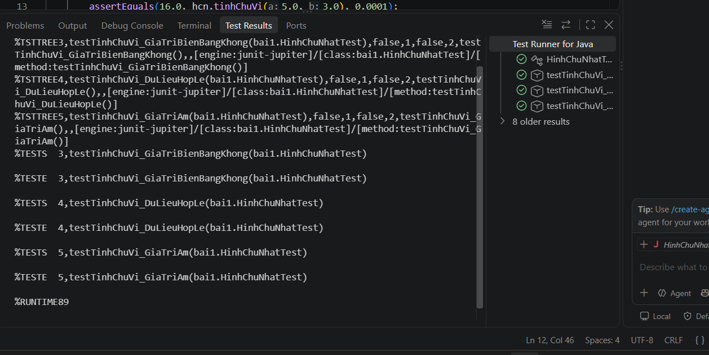
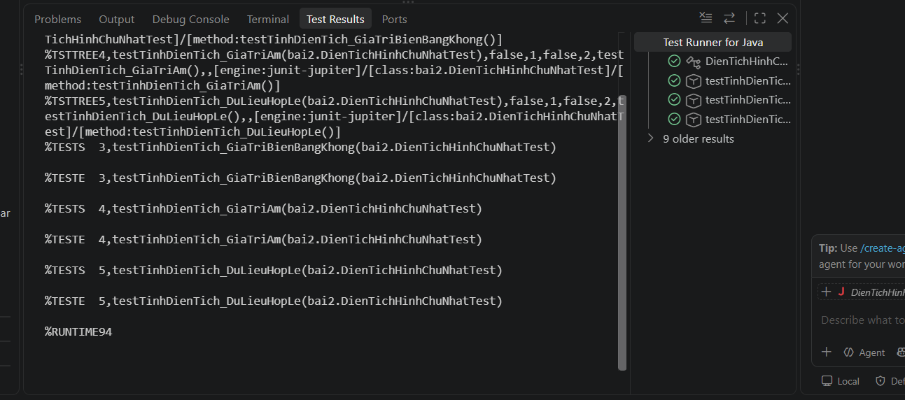
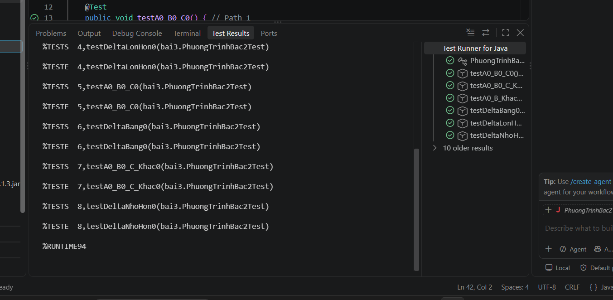
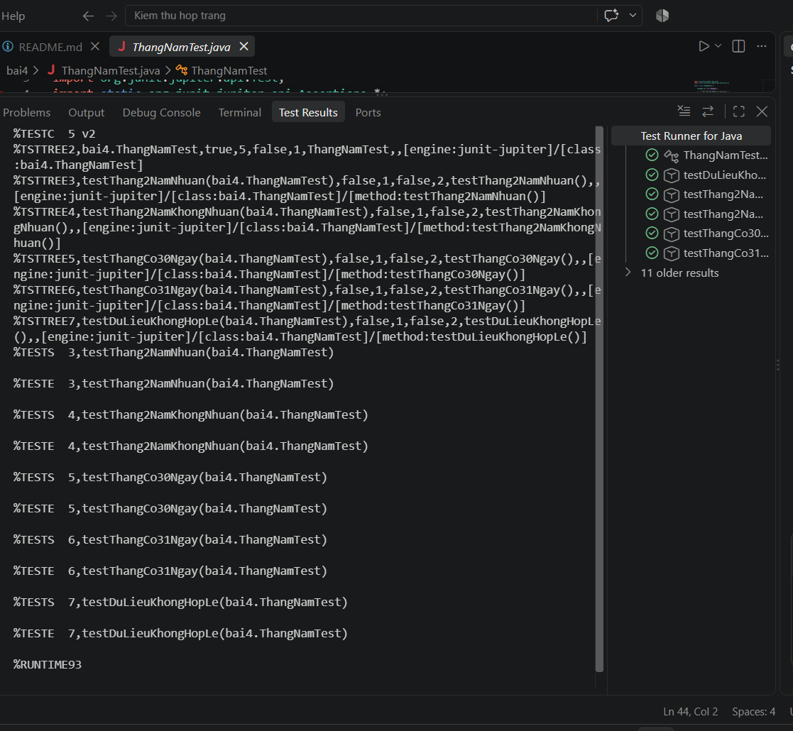
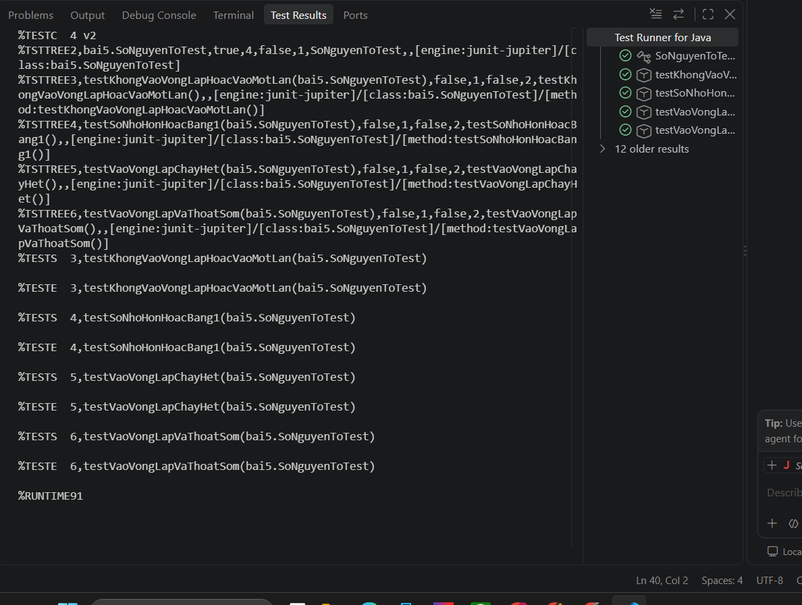
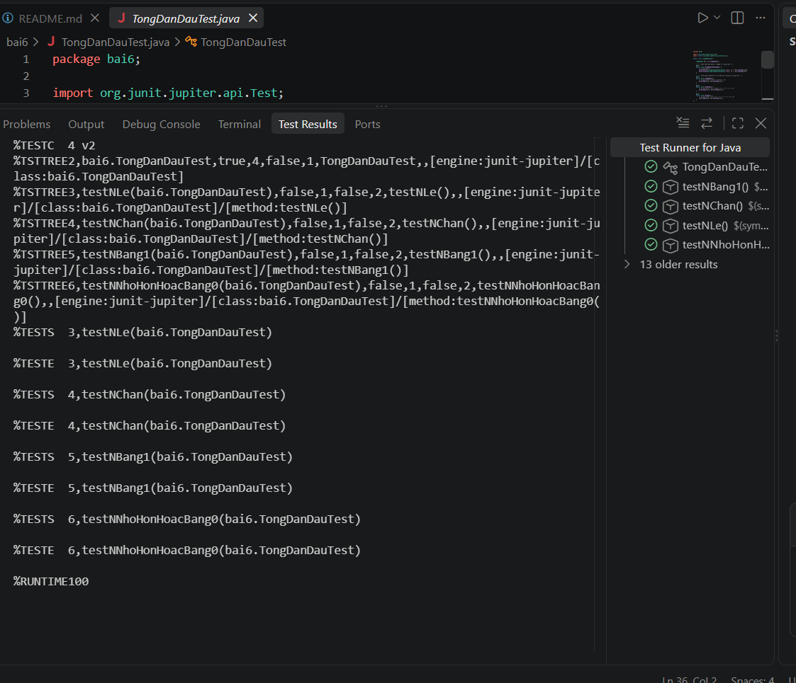
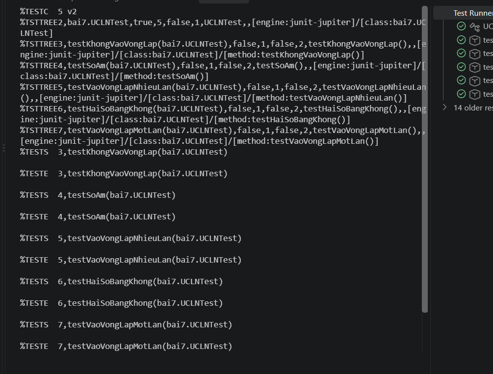

# 🧪 Bài Tập Thực Hành: Kiểm Thử Hộp Trắng (White-box Testing)
## 📖 Giới thiệu
Dự án này bao gồm mã nguồn và kịch bản kiểm thử (Test Cases) cho 8 bài toán cơ bản nhằm thực hành kỹ thuật **Kiểm thử hộp trắng**. Toàn bộ các ca kiểm thử được thiết kế để bao phủ 100% các dòng lệnh (Statement Coverage) và các nhánh điều kiện (Branch Coverage).

## 🗂️ Danh sách các bài toán
1. **Bài 1:** Tính chu vi hình chữ nhật
2. **Bài 2:** Tính diện tích hình chữ nhật
3. **Bài 3:** Giải phương trình bậc 2 ($ax^2 + bx + c = 0$)
4. **Bài 4:** Tính số ngày của tháng (có xử lý năm nhuận)
5. **Bài 5:** Kiểm tra số nguyên tố
6. **Bài 6:** Tính tổng đan dấu ($1 - 2 + 3 - 4 + ... + n$)
7. **Bài 7:** Tìm ước chung lớn nhất (UCLN)
8. **Bài 8:** Tính tổng giai thừa ($1! + 2! + ... + n!$)

---

## 📸 Minh chứng chạy Test (Test Results)
Dưới đây là hình ảnh minh chứng quá trình chạy JUnit 5 thành công cho toàn bộ các bài tập. Các Test Case đã đi qua toàn bộ các luồng ngoại lệ, rẽ nhánh và vòng lặp.

### 🟢 Bài 1 & Bài 2: Hình chữ nhật

### 🟢 Bài 3 & Bài 4: Rẽ nhánh phức tạp

### 🟢 Bài 5, 6, 7 & 8: Vòng lặp

---
*Dự án hoàn thành trong đợt đánh giá chất lượng học phần tại Đại học Phenikaa.*